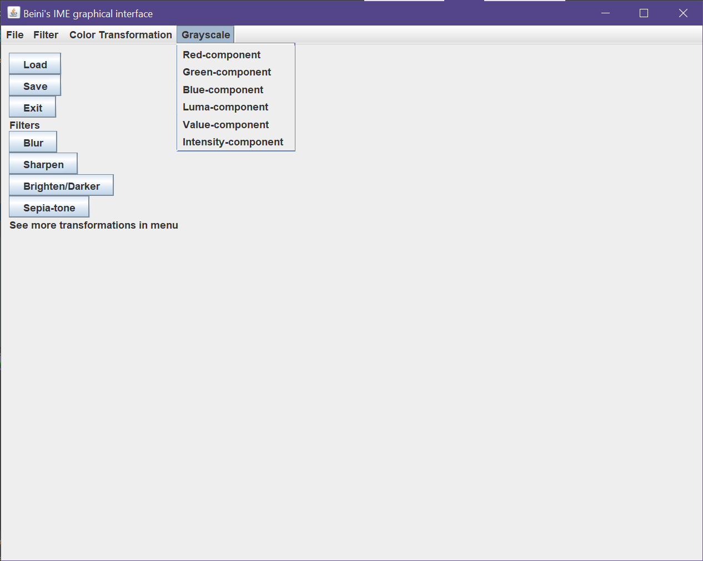

This README is for the Image Manipulation and Enhancement Program.
The GUI contains buttons "Load", "Save", "Exit", "Blur", "Sharpen", "Brighten/Darker", "Sepia-tone" buttons menu and submenus for  "File", "Filter", "Color Transform", and "Grayscale". Every action is accessible through these submenus. Click on the button or menu items to load image, filter or save the showing image.

See below the screen shot for buttons and each menu:
- Buttons that supports load an image file, save the showing image, exit the program and blur, sharpen, brightened/darken, sepia tone the showing image.

- File Menu supports load an image file and save the showing image.

- Filter Menu supports blur, sharpen and brighten/darken the showing image.

- Color transformation Menu supports sepia-tone, luma, red, green, blue, and intensity matrices gray-scale the showing image.

- Grayscale Menu supports value, intensity, luma, red, green, blue component gray-scale the showing image.

Each Action Note/Error message example:
- Load: You may load image from any folder of your computer.

When loading image, you will see this window for you to select the file, the default image file types are ppm/png/jpg/bmp files. If you are loading JAVA ImageIO supported other types of files, please change the File of Type to all files. If the selected file type is not supported, you will see the following error message.

 

Also, you will need load a image before saving, filtering an image.     

You will see following error message if save/filter with no current showing image.

After loading an image, if the image is larger than the window size, scroll bars will show up, see example:

- Save:

When saving a showing image, you will see this window for you to enter the name and extension for the image. The supported image file types are ppm/png/jpg/bmp and other ImageIO supported types. If the type is not supported, error message will show. The default saving folder is the current folder but you may change to other directory.

- Brighten/Darken

When brighten/darken the showing image, a pop up window will show and ask for the increment of brighten(positive integer) or darken(negative integer). 

If entering input is not an integer, the following error message will show.

- All other filter/color transformation/grayscale
Click on the menu items/button to apply the according filter/color transformation/grayscale on the current showing image. The blur/sharpen/brighten can be applied multiple times, all other may have the same result.

- Click on Exit button OR click on top right to close the window to exit the program.